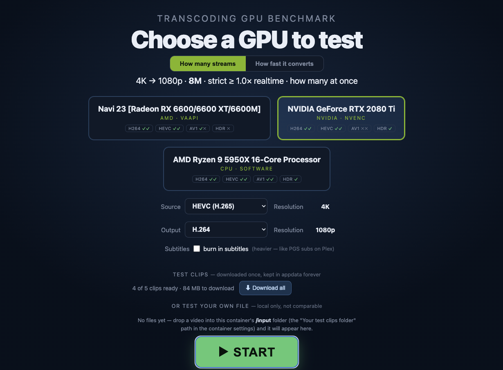
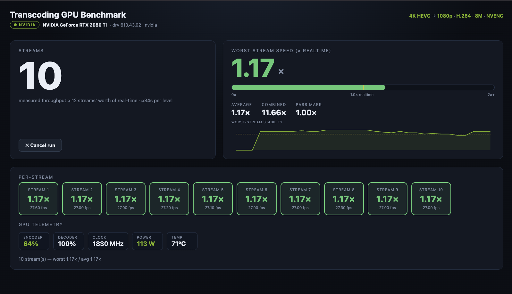
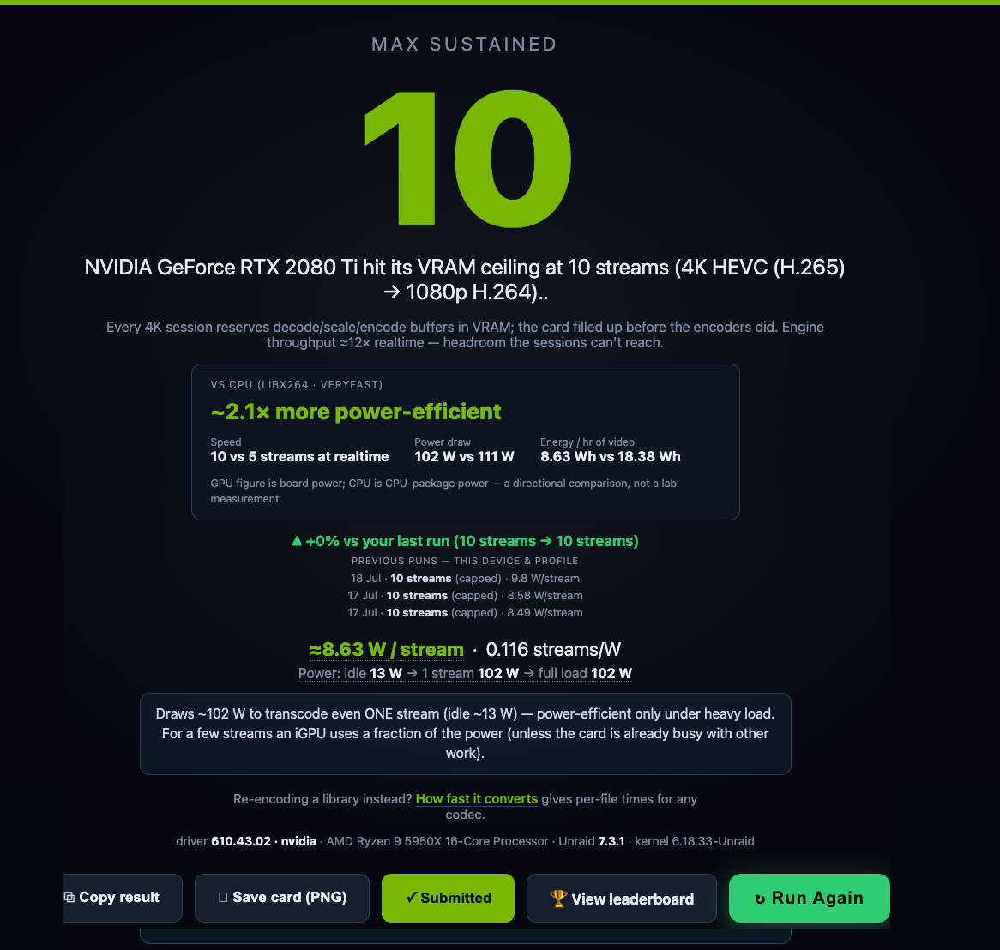
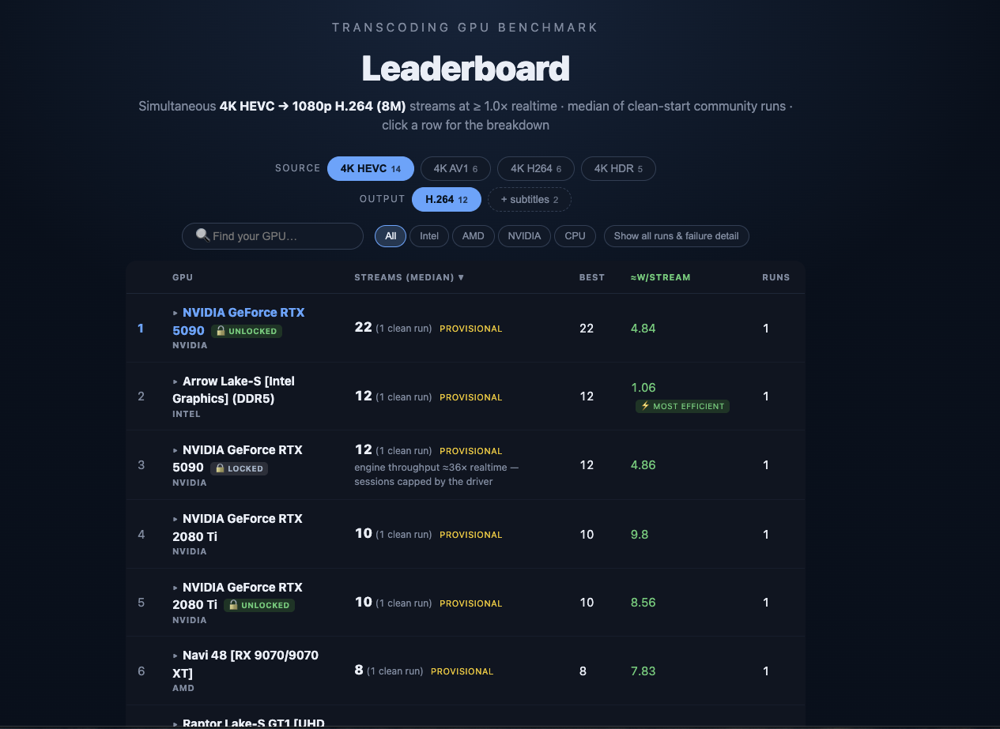

# Transcoding GPU Benchmark

This tells you how many 4K films your server can transcode at once before it runs out of steam, and how your hardware stacks up against everyone else running the same test.

I kept wanting a straight answer to "how many streams will this GPU actually do", and every figure I could find was either a guess or measured a different way to the next one. So I built this. You pick a device, hit start, and watch a live scoreboard climb as it piles on more and more simultaneous streams. When the slowest stream can no longer keep up with real time, that's your number. Same clips and same rules on every machine, so the results actually mean something when you put them side by side.

It works with Intel, AMD and NVIDIA GPUs, and with plain CPU software encoding if you haven't got a GPU worth testing. There's a public leaderboard at [gpu.spaceinvader.one](https://gpu.spaceinvader.one) where you can submit your result and see where you land.

## What it actually measures

There are two jobs this does, and they answer different questions.

The first is how many streams at once. This is the headline test. It takes a 4K HEVC file and transcodes it down to 1080p H.264 at 8 Mbit, the same sort of work Plex or Jellyfin does when someone plays a 4K film on a device that can't handle it. It runs one of those, checks it's keeping up with real time, then two, then three, and keeps climbing. The moment the worst stream drops below real time it stops, and it gives you the highest number where every single stream was still keeping up. There's no averaging here. If one stream out of twelve stutters, twelve doesn't count, so the number you get is one you can actually rely on.

The second is how fast, which is conversion mode. That's for when you're re-encoding your library with something like Tdarr or Unmanic rather than serving live streams. There's no real time limit in this mode, it just runs flat out and tells you how quickly a single file converts and how many parallel workers gets you the most throughput. On a lot of hardware the fastest setting is fewer workers than I expected the first time I ran it, and this shows you exactly where that sweet spot is on yours.

Streaming mode is the one that goes on the leaderboard, because it's the fixed test everyone runs the same way.

Those two modes are the heart of it, but they aren't all it does. You can switch the source and output to different codecs, throw a 4K HDR file at it to see what tone mapping costs your card, or burn subtitles into the picture. You can point it at your own video files instead of the built in clips. And if you've got more than one device, it'll run the whole test across each of them and hand you a comparison table at the end. There's full detail on all of it further down in Beyond the standard test, I just didn't want you scrolling past thinking it only does the one job.

## Installing it

If you're on Unraid, search Community Apps for Transcoding GPU Benchmark and install it from there. That's the easiest way and it pulls the template in for you.

Intel and AMD GPUs work out of the box through the `/dev/dri` device that's already in the template. There's nothing else to set up.

For NVIDIA you make one change. Add this to the Extra Parameters field.

```
--runtime=nvidia
```

That's it. The NVIDIA variables are already set in the template, and you'll need the Nvidia Driver plugin installed on your server, which most people running an NVIDIA card already have. On a machine that's NVIDIA only, with no Intel or AMD GPU, you can also remove the `/dev/dri` device since there's nothing there to pass through.

Once it's running, open the WebUI on port `8088` and you'll get the picker screen with every device it found.



### Running it without Unraid

You don't need Unraid to run this. It's a normal Docker container, so anything that runs Docker will do.

The tidiest way is Docker Compose. There's a `docker-compose.yml` in the repo already set up for Intel and AMD, with the NVIDIA changes noted in the comments. Grab that file, then from the same folder run `docker compose up` and open port `8088` on the host. When you're done, `docker compose down` stops and removes it.

If you'd rather do it in 1 line, here's the Intel or AMD version.

```
docker run --rm -p 8088:8088 \
  --device /dev/dri:/dev/dri \
  --tmpfs /ramdisk:rw,size=512m \
  -v tgb-config:/config \
  -v /etc/os-release:/os-release:ro \
  spaceinvaderone/transcoding-gpu-benchmark:latest
```

For NVIDIA, drop the `--device /dev/dri` line, add `--runtime=nvidia`, and pass `-e NVIDIA_VISIBLE_DEVICES=all -e NVIDIA_DRIVER_CAPABILITIES=all`. You'll want the NVIDIA Container Toolkit installed on the host, the same bit of plumbing the Unraid Nvidia Driver plugin sets up for you.

The one mount worth a word is `/etc/os-release`. That's how the leaderboard knows which OS you're on, it just reads your distro's name from it. Leave it off and everything still works, your result simply doesn't carry an OS. The compose file has the rest of the optional mounts in it as well, for CPU power readings and pointing it at your own video files, all commented out so you can switch on whatever you fancy.

### The first run downloads the test clips

The image itself is small. The actual benchmark clips, which come to about 1.8 GB, download on your first run and get cached in `/config` so they're only ever fetched once. Container updates won't pull them again.

Every clip is checksummed against a pinned release as it downloads, so everyone on the leaderboard is measured against byte for byte identical files. If a download ever gets corrupted, it spots the bad checksum and grabs a fresh copy rather than quietly giving you a wrong result.

## Reading your result

Pick a device, leave the source and output on their defaults for the standard test, and press start. The scoreboard shows each stream's speed live as it ramps up, and when it finishes you get your headline number along with the power draw and efficiency figures.





The efficiency numbers are where it gets interesting for me. A discrete GPU pulls a lot of power the moment it does anything, so it only looks good per stream when it's running plenty of them. An Intel iGPU sips power by comparison. If you run a CPU baseline as well, you'll see just how much more efficient a media engine is than software encoding for the same job, and that gap was bigger than I'd have guessed. On my own boxes the iGPU came out something like forty times more efficient than the CPU doing the identical work.

## The leaderboard

Once you've got a streaming result you can submit it to [gpu.spaceinvader.one](https://gpu.spaceinvader.one) with the button on the verdict screen. The board ranks cards by the median of clean runs rather than the single best score anyone managed, so it reflects what you'll typically get, not a lucky one off.



A few things it shows that are worth knowing about.

For Intel integrated graphics it splits cards by memory generation, so a UHD 770 on DDR4 and the same chip on DDR5 show up separately. The iGPU shares your system RAM as its video memory, so faster RAM genuinely moves the score, and keeping them apart stops that muddying the ranking.

For NVIDIA cards it detects whether the driver's NVENC session limit has been patched out, and marks each card as locked or unlocked with a small padlock. Consumer NVIDIA drivers cap how many encode sessions you can run at once, and some people patch that limit away. A locked and an unlocked version of the same card are ranked as separate entries, so you can see for yourself whether unlocking actually bought anything. Honestly, on a lot of modern cards it buys you nothing, because they run out of memory or raw throughput long before the session cap ever comes into play. Being able to see a locked and unlocked card land on the same number tells you that at a glance.

### Your privacy

The leaderboard doesn't need an account and doesn't collect anything personal. Each install gets a random ID that isn't derived from your hardware, purely so a resubmission updates your existing entry instead of stacking up duplicates. Your IP address is salted and hashed for rate limiting and the raw address is never stored. What shows publicly is the hardware stuff you'd want to compare, the GPU name, the RAM type, the stream count and the power figures, and nothing else.

## Beyond the standard test

The standard 4K HEVC to 1080p H.264 test is what the leaderboard is built on, but the tool does a fair bit more, all of it local only and never submitted.

You can change the source and output codecs to match whatever you actually run. If you want to know how your card handles converting your library to AV1, or transcoding HEVC to HEVC, it's all there in the source and output pickers, and it only offers combinations your hardware can genuinely do. It probes each device up front, so if your card can decode AV1 but not encode it, you'll see that rather than getting a silent software fallback.

There's an HDR profile that tone maps a 4K HDR10 file down to SDR, which is one of the heaviest jobs a media server ever does. There's a subtitle burn in toggle for the streaming test too, since burning subtitles into the picture is far more demanding than it sounds and it's worth knowing what it costs you.

If you'd rather test your own files, mount a folder at `/input` and drop a video or two in. They turn up in the picker with the codec and resolution detected automatically, and the benchmark samples sixty seconds from the middle of the file so it's measuring a real busy part rather than an easy intro. Anything you test this way stays on your own machine and never goes near the leaderboard.

There's also a batch mode if you've got more than one device, which runs the same test across each of them in turn and gives you a comparison table at the end. It runs them one at a time on purpose, because running two at once would have them fighting over the same CPU and PCIe bandwidth and the power numbers would be meaningless.

## Optional extras in the template

A few mounts in the template are optional and safe to leave exactly as they are. They add nicer detail to your results and the benchmark runs fine without any of them.

`/powercap` gives real CPU package power readings from the kernel's energy counters, the same source the Unraid dashboard uses, so CPU and iGPU tests can show actual watts. `/dmi` lets it read your RAM type and speed for Intel iGPU runs, which is handy for explaining why two identical chips score differently. `/dynamix.cfg` lets the temperature readout follow your Unraid display setting, so if your dashboard is in Fahrenheit, this is too. `/unraid-version` just adds your Unraid version to the result.

The one setting you might ever touch is `MAX_STREAMS`, which caps how high the ramp climbs. The default is fine for almost everything. A very fast card that ends a run still saying it hit the cap is the only reason to raise it.

## A note on security

This is a trusted LAN tool, the same as most Unraid containers. The WebUI has no login, because it's meant to be reached from your own network. Don't port forward `8088` to the internet or expose it through a reverse proxy without putting authentication in front of it. There's nothing sensitive in it, but it can start a benchmark and use your GPU, and that's not something you want open to the world.

## How it works

The benchmark reads each stream's real time speed straight from ffmpeg's own progress output, working it out from how much video time is produced per second of wall clock time. A stream running at 1.0x is keeping pace with real time, which is exactly what a live playback session needs.

It's built on jellyfin-ffmpeg, the same ffmpeg build and driver stack Jellyfin ships, so the hardware acceleration is the well tested version rather than something hand rolled. The Jellyfin server itself never runs, the image just borrows the ffmpeg binary and drivers and boots straight into the benchmark.

The clips are minted from a fixed pattern at known settings and pinned to a release, so the workload can't drift over time. That's the whole reason the numbers are comparable between machines and between people.

## Credits and licence

The NVIDIA lock detection uses the driver signatures from [keylase/nvidia-patch](https://github.com/keylase/nvidia-patch), which is MIT licensed. That project is what makes it possible to tell a patched driver from a stock one.

This project is released under the MIT licence. See [LICENSE](LICENSE) for the full text.
